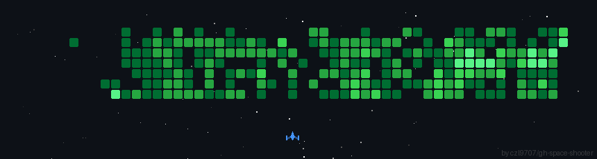

<h1 align="center">👋 Assalomu alaykum, I'm Akobir Rustamov</h1>

  <strong>💻 Full-stack Developer | 🤖 AI & Automation Enthusiast | 📱 Mobile Developer |  🤖 Telegram Bot Developer | 🔌 API Integrator</strong> 
  <em>🧠 I turn ideas into code — from bots to mobile apps to backend system.</em>

  
  
  
  
  
  
  
  
  
  
  

----

### 🚀 About Me

- ⚙️ **Languages & Frameworks**: Python, FastAPI, Java, Spring Boot, JavaScript, React.js, React Native
- 🤖 **Bot Development**: Mastering Telegram bots with **Aiogram** and async programming
- 📱 **Mobile Apps**: Developing cross-platform apps using **React Native**
- 🧠 **AI & Automation**: Integrating AI/ML and automating systems for real-world use
- 📊 **APIs & Systems**: Skilled in **RESTful API** design and **trading integrations**
- 🛠️ **Tools**: Git, Docker, Postman, VS Code, IntelliJ IDEA

----

### 📫 Let's Connect

  
  
  

----

  💡 <em>“Code is not just syntax — it's creativity made executable.”</em>

